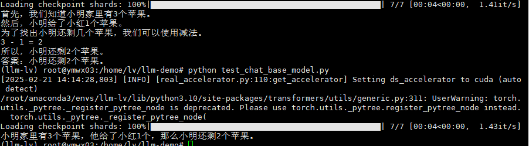

# 项目简介

该项目使用Lora等微调方法,支持对chatglm3-6b等大模型的指令微调。   
使用unsloth工具对Llama-3.2-3B-instruct进行微调。

# 项目环境

详细可见requirements.txt文件

# 训练数据集

1. school_math.0.25M.json(共计25万条数据)。下载地址: https://huggingface.co/datasets/BelleGroup/school_math_0.25M
2. maxime labonne's finetome-100k。下载地址: https://huggingface.co/datasets/mlabonne/FineTome-100k

# 训练情况

| 模型        | 训练方法             | 模型总参数量 | 可训练参数量 | batch_size | 显存占用   | Lora Rank | Lora Alpha |
|-------------|------------------|--------------|--------------|------------|--------|-----------|------------|
| chatglm3-6b | Lora             | 6247428096   | 3844096      | 8          | 23.14G | 2         | 1          |
| chatglm3-6b | QLora(量化到4bit)   | 3392155648   | 3844096      | 8          | 19.97G | 2         | 1          |
| chatglm3-6b | QLora(量化到4bit)   | 3419064320   | 30752768      | 10         | 19.97G | 16        | 8          |
| Llama-3.2-3B-Instruct| unsloth(量化到4bit) | 1827777536   | 24313856      | 10         | 3.6    | 16        | 16         |

# 注意事项

1. 该项目是在单张24G显存的3090卡上面进行实验的，多卡后续会#TODO。
2. 该项目使用的是lora、qlora微调方法,只保存了adapter的权重(即代码中可训练的全连接层),因此需要将adapter与基础模型的权重进行合并。 详情可见merge_models.py文件。
3. 模型训练完成后可使用test_chat.py文件对模型进行测试验证。

# 未来工作

1. lora rank 和 batch size 都增大后,训练使用的显存却增长至20G左右就不再增大,后续有待验证,找出原因。
2. 后续使用Unsloth模型微调工具进行尝试。√

# 效果展示

